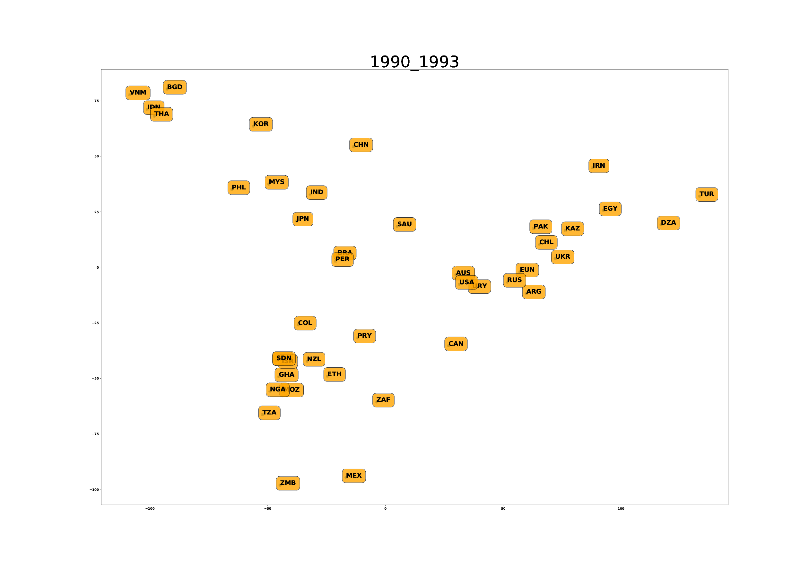
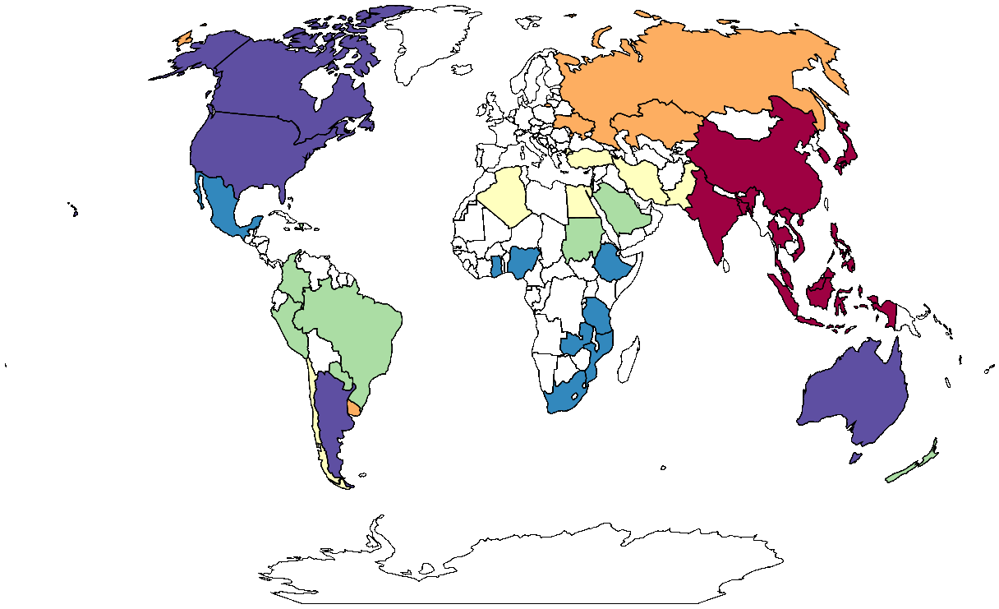
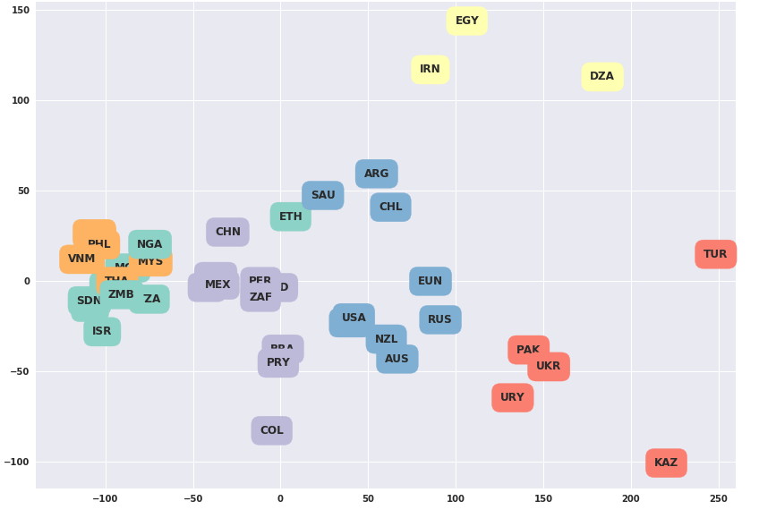

# Food-Habits-Tendencies
[Paper Version](https://drive.google.com/file/d/1-MTM3iNqXI6CqdchXOnqgToaiK7mHAXW/view?usp=sharing)
 
Changes in food consumption per years.

## Data
Main dataset used in this project was taken from [OECD website](http://www.oecd.org/)
Part of the data we used can be found [here](https://drive.google.com/file/d/1ox8dVyJQVZN9lEoe4prMy0xvh1U6AfIk/view?usp=sharing) .

## Approach

Analysing nutritional habits requires unsupervised approach, so we used machine learning method - <b>clustering</b>.  
Namely, k-means and DBSCAN algorithms. We also applied PCA and t-SNE dimensionality reduction to visualize high-dimensional data. 

## Results
K-means clustering 1990-2016:
 

Results of PCA on k-means clustered data during 2013-2016:  
 

Built model shows direction in which country is moving in coordinates of nutritional features from one nutrition-habit group to another and prognosis  of  future nutritional habits state. Thus, this approach can be used by food production companies to decide in which country to invest in which commodity based on its food habits. 
Now these results can be interpreted in various other applications of chosen problem.

